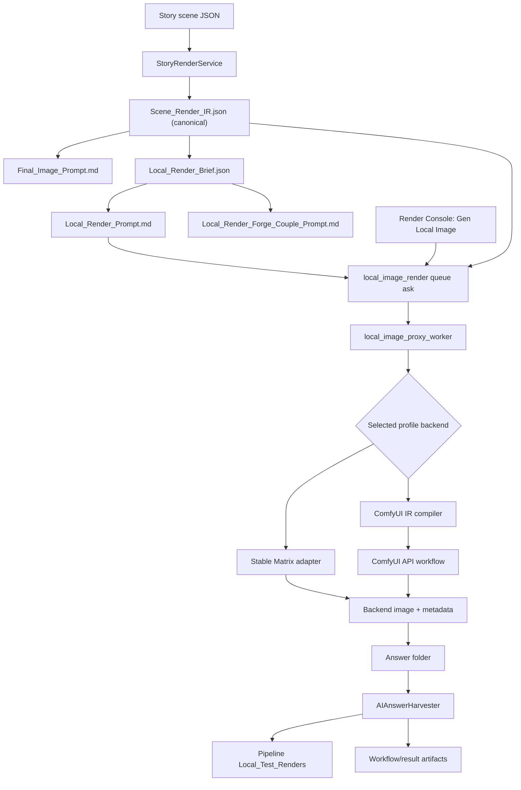

# Local Image Generation

This document describes Zet's complete local image generation process: configuration, scene compilation, backend dispatch, ComfyUI and Stable Matrix execution, filesystem queue processing, artifact harvesting, direct CLI use, and troubleshooting.

The checked-in reference snapshot is in [`Docs/Old/ComfyUI_Example`](Old/ComfyUI_Example/README.md). It is a real successful preview of the `FirstDay` story scene `Chapter-03-Collision`.

## Purpose and boundaries

Local image generation produces review images from Zet prompts and scene data. It is separate from the final story-image workflow:

- A local preview does not advance an asset or scene pipeline stage.
- A local preview does not overwrite the final story image.
- Manual ChatGPT final renders continue to use `Final_Image_Prompt.md`.
- Scene previews use `Scene_Render_IR.json` as their canonical structured input.
- Prompt-only character assets can render through either backend without an IR.

Two local backends are implemented:

| Backend | Primary API | Structured scene layout |
| --- | --- | --- |
| Stable Matrix | Automatic1111-compatible `/sdapi/v1/txt2img` | `Local_Render_Brief.json`, optionally Forge Couple |
| ComfyUI | `/prompt`, `/history/{prompt_id}`, `/view` | Compiled directly from `Scene_Render_IR.json` |

## End-to-end flow



## Configuration

Project settings are stored in `config.toml`. The Image Config page edits the same values.

### Backend selection

```toml
[LocalRender]
AutoQueueAfterCondense = false
Backend = "comfyui"
```

`Backend` is either `stable_matrix` or `comfyui`. Stable Matrix remains the compatibility default when the setting is absent.

### Stable Matrix settings

```toml
[StableMatrix]
Profile = "body-reference-preview"
PositivePromptGlobals = "(masterpiece, best quality, highres), sharp focus"
NegativePromptGlobals = "EasyNegative"
LayoutBackend = "forge_couple_basic"
StrictPrimarySubjectCount = true
ForgeCoupleDebugBasePass = true
Checkpoint = "sd\\checkpoint.safetensors"
```

- `Profile` selects a Stable Matrix entry from `Config/Local_Render_Presets.json`.
- `PositivePromptGlobals` and `NegativePromptGlobals` are appended without duplicating existing terms.
- `LayoutBackend` is `forge_couple_basic` or `plain_txt2img`.
- `Checkpoint` is sent as `override_settings.sd_model_checkpoint`.
- Forge Couple settings affect only Stable Matrix.

### ComfyUI settings

```toml
[ComfyUI]
Profile = "comfyui-core-preview"
ServerURL = "http://127.0.0.1:8188"
Checkpoint = "checkpoint.safetensors"
PositivePromptGlobals = "(masterpiece, best quality, highres), sharp focus"
NegativePromptGlobals = "EasyNegative"
PollSeconds = 1.0
TimeoutSeconds = 300.0
```

- `Profile` selects a ComfyUI entry from `Config/Local_Render_Presets.json`.
- `ServerURL` identifies an unauthenticated local ComfyUI server.
- `Checkpoint` must exactly match a filename reported by ComfyUI.
- Prompt globals are independent from Stable Matrix globals.
- `PollSeconds` controls history polling.
- `TimeoutSeconds` limits a workflow run.

### Render profiles

`Config/Local_Render_Presets.json` holds backend-specific generation parameters. The default ComfyUI profile is:

```json
{
  "comfyui-core-preview": {
    "backend": "comfyui",
    "workflow_kind": "core_txt2img_scene_preview",
    "short_side": 640,
    "max_long_side": 960,
    "steps": 28,
    "cfg": 7.0,
    "sampler_name": "dpmpp_2m",
    "scheduler": "karras",
    "denoise": 1.0,
    "seed": "random",
    "supports_reference_images": false,
    "supports_pose_control": false,
    "supports_masks": false,
    "return_all_images": true,
    "output_subdir": "Local_Test_Renders"
  }
}
```

Profiles contain generation parameters, not project-specific checkpoint or prompt-global choices. The Image Config API returns profiles grouped by backend so each backend keeps its own selection.

ComfyUI compilation is profile-driven:

- `comfyui-core-preview` uses `core_txt2img_scene_preview`, the built-in-node baseline.
- Prompt-only assets automatically use `core_txt2img_prompt_only`.
- `comfyui-ipadapter-preview` uses `ipadapter_scene_preview` and resolved reference assignments.
- `comfyui-openpose-preview` reserves `openpose_scene_preview`; it is disabled until a pose workflow consumes the persisted control artifact.

The capability flags declare workflow intent without changing existing profile parsing.

### Image Config page

Open **Controls → Image Config**:

1. Choose Stable Matrix or ComfyUI in **Image generation**.
2. Configure the visible backend panel.
3. Use the backend's checkpoint refresh button.
4. Save project settings.

Stable Matrix checkpoint discovery uses `/sdapi/v1/sd-models`. ComfyUI checkpoint discovery reads `CheckpointLoaderSimple` choices from `/object_info/CheckpointLoaderSimple`.

Switching the dropdown does not copy or overwrite checkpoint and prompt-global values between backends.

## Scene compilation and the canonical IR

A story scene begins with:

```text
<BaseLibraryPath>/Stories/<story>/<scene>.scene.json
```

When Zet compiles or stages the scene, `StoryRenderService`:

1. Loads and normalizes schema-v3 scene JSON.
2. Resolves asset and auxiliary-resource references.
3. Loads story settings and prompt-section templates.
4. Calls `compile_scene_render_ir(...)`.
5. Writes the pipeline artifacts.

The pipeline folder is:

```text
<BasePipelinePath>/Stories/<story>/<scene>/
```

### `Scene_Render_IR.json`

The IR is the canonical local scene-render intermediate. It has `schema_version: 3` and contains:

- scene identity and story beat;
- source paths and hashes;
- canvas orientation and aspect ratio;
- composition and left-to-right ordering;
- art style and visual-continuity data;
- environment;
- resolved scene elements;
- placements, pose, motion, gaze, and depth;
- props and interactions;
- dialogue for non-diffusion downstream consumers;
- reference assignments;
- resolved source descriptions.

Before ComfyUI compilation, Zet validates:

- schema version 3;
- required object and array structures;
- nonblank, unique element IDs;
- placement references to known elements.

ComfyUI prompt generation uses the descriptions already resolved into the IR. It does not maintain a second character, costume, or place lookup table.

### Derived scene artifacts

| Artifact | Role |
| --- | --- |
| `Final_Image_Prompt.md` | Full manual/final render prompt |
| `Scene_Render_Validation.json` | Scene warnings and errors |
| `Local_Render_Brief.json` | Backend-neutral preview prompt/layout derivation |
| `Local_Render_Prompt.md` | Labeled positive/negative txt2img prompt |
| `Local_Render_Forge_Couple_Prompt.md` | Human-readable Stable Matrix Forge Couple form |
| `Prompt_Source_Map.json` | Source attribution for generated prompt sections |
| `dependency_manifest.json` | Resolved reference-file contract |

The local brief and prompt files are derived artifacts. If they disagree with the IR, regenerate the scene pipeline rather than editing the derived files as a long-term fix.

## Backend-neutral render contract

Local rendering is dispatched through `LocalRenderRequest` and returns `LocalRenderResult`.

The request carries:

- project root;
- final or local prompt path;
- job output directory;
- selected profile;
- optional prompt-review path;
- optional `Scene_Render_IR.json` path;
- reference-file records;
- aspect ratio;
- optional Stable Matrix layout.

The result carries:

- generated image path;
- backend metadata path;
- prompt-review path;
- backend prompt ID;
- extra artifact paths for harvesting.

The compatibility entrypoint remains `Scripts.Local_Render_Adapters.render_image(...)`. It converts legacy keyword arguments into the backend-neutral request and dispatches on the profile's `backend` value.

## Stable Matrix execution

Stable Matrix supports both prompt-only assets and scene previews.

### Prompt construction

The adapter reads a labeled prompt:

```text
prompt: positive prompt text
negative: negative prompt text
```

For prompt-only assets it sends a normal txt2img request. For scenes:

- `plain_txt2img` uses the flat local prompt;
- `forge_couple_basic` uses the structured lines and mappings derived from `Local_Render_Brief.json`;
- configured Stable Matrix globals and checkpoint overrides are applied immediately before submission.

### Request and outputs

The adapter posts to `/sdapi/v1/txt2img`, decodes the first returned image, and writes:

```text
Stable_Matrix_API_Call.json
Local_Test_Renders/test_<timestamp>.png
Local_Test_Renders/test_<timestamp>.json
```

`Stable_Matrix_API_Call.json` records the exact payload sent to the backend.

## ComfyUI execution

ComfyUI uses a workflow compiler registry. A profile's `workflow_kind` selects a scene compiler, while prompt-only assets route to the compatible prompt compiler.

### Scene IR mode

`compile_ir_to_comfyui_workflow(...)`:

1. Validates the IR.
2. Derives a concise global prompt, contradiction-aware negative prompt, and identity-first ordered character prompts.
3. Appends ComfyUI-specific prompt globals.
4. Derives dimensions from the IR aspect ratio and profile limits.
5. Resolves a fixed or random seed.
6. Selects the profile's registered workflow compiler and produces API-format workflow JSON.

### Scene layout planning

The backend-neutral layout planner derives one normalized box per visible primary character from `composition.left_to_right`, `position_within_cell`, depth, optional focal point, and optional scale hints.

- One character receives nearly the full useful canvas.
- Two characters receive broad, slightly overlapping left/right boxes.
- Three or more characters use explicit horizontal anchors and foreground, midground, or background geometry.
- Characters sharing a lane are deterministically nudged apart.
- A focal subject receives a larger box and stronger conditioning.
- Backdrops remain in global conditioning so they do not compete equally with character branches.

Both normalized and pixel rectangles, conditioning strengths, and resolved subject order are persisted in `ComfyUI_Compilation_Debug.json` and render metadata. `ComfyUI_Pose_Layout_Control.json` records the same boxes as the first pose/layout-control artifact; the core workflow does not consume it yet.

The initial workflow uses only built-in nodes:

- `CheckpointLoaderSimple`;
- `CLIPTextEncode`;
- `EmptyLatentImage`;
- `ConditioningSetArea`;
- `ConditioningCombine`;
- `KSampler`;
- `VAEDecode`;
- `SaveImage`.

Dialogue is intentionally omitted from diffusion prompts.

### Reference-image conditioning

The core profile never uses reference images. The explicit `comfyui-ipadapter-preview` profile consumes reference assignments from the IR and resolved reference paths. It records each element-to-reference binding and applies character and backdrop weights separately.

This profile requires `LoadImage` plus the `CLIPVisionLoader`, `IPAdapterModelLoader`, and `IPAdapterAdvanced` nodes supplied by ComfyUI_IPAdapter_plus, configured `ipadapter_model` and `clip_vision_model` filenames, existing resolved files, and corresponding images available to ComfyUI's input loader. Zet checks the server's node inventory and fails clearly when requirements are missing. It never silently falls back to the core workflow.

The next enhanced stage is `openpose_scene_preview`. Its expected input is `ComfyUI_Pose_Layout_Control.json`; its eventual output is an OpenPose or layout-control image consumed by a registered workflow. The placeholder profile remains disabled until that renderer is implemented.

### Prompt-only mode

If no IR is supplied, the adapter compiles the labeled positive and negative prompt into a plain core-node txt2img workflow. This permits character-asset local previews when ComfyUI is selected.

### Dimensions

The compiler preserves the requested aspect ratio subject to profile limits:

- start with `short_side`;
- calculate the corresponding long side;
- cap the long side at `max_long_side`;
- reduce the other side when capped;
- round both dimensions to multiples of eight.

The example scene requests `4:5` and compiles to `640 × 800`.

### Submission and download

`run_comfyui_workflow(...)`:

1. Posts `{"prompt": workflow}` to `/prompt`.
2. Rejects returned workflow or node validation errors.
3. Polls `/history/{prompt_id}` until completion or timeout.
4. Rejects execution-error status.
5. Reads output image descriptors.
6. Downloads each image through `/view`.
7. Sanitizes server filenames before writing locally.

Connection failures are reported as backend-unavailable errors. Invalid JSON, missing prompt IDs, timeout, execution failures, and missing output images are reported as local-render errors.

### ComfyUI artifacts

```text
ComfyUI_Workflow_API.json
ComfyUI_Compilation_Debug.json
ComfyUI_Pose_Layout_Control.json
Local_Test_Renders/ComfyUI_Render_Metadata.json
Local_Test_Renders/<ComfyUI output image>
```

The workflow file is directly submit-ready API JSON, not the ordinary ComfyUI editor graph format.

Render metadata records:

- timestamps and elapsed time;
- backend, profile, workflow kind, and full profile settings;
- server URL and checkpoint;
- source IR path and SHA-256;
- source prompt path;
- compiled global, negative, and per-region prompts;
- normalized and pixel layout boxes, subject order, and conditioning strengths;
- resolved reference bindings used by enhanced profiles;
- resolved seed and dimensions;
- ComfyUI prompt ID and output descriptors;
- downloaded image paths.

## Filesystem queue lifecycle

The Render Console's **Gen Local Image** action uses the filesystem proxy.

### 1. Staging

For a scene preview, Zet creates an `Ask_*` folder containing:

- `ask_manifest.json`;
- `Local_Render_Prompt.md`;
- `Scene_Render_IR.json` when ComfyUI is selected.

Important manifest fields include:

| Field | Meaning |
| --- | --- |
| `worker_type` | `local_image_render` |
| `task_type` | `local_test_render` |
| `render_preset` | Selected backend profile |
| `workflow_kind` | Selected ComfyUI workflow intent |
| `scene_render_ir_file` | Queue-local canonical IR filename |
| `expected_output` | Queue answer image filename |
| `target_output_dir` | Pipeline `Local_Test_Renders` folder |
| `artifact_output_dir` | Pipeline folder for workflow/metadata |
| `source_ask_id` | Render Console task that requested the preview |

Reference records are carried through every ask. The core profile preserves but does not consume them; the IP-Adapter profile consumes resolved assignments.

### 2. Claiming and rendering

`AI_Manager/local_image_proxy_worker.py`:

1. Claims one compatible ask.
2. Moves it to `Claimed/<worker-id>/`.
3. Dispatches through the selected render profile.
4. Copies the chosen image to `expected_output`.
5. Copies backend artifacts into the answer folder.
6. Writes `LOCAL_RENDER_METADATA.json`.
7. Writes `answer_manifest.json`.
8. Moves the completed folder to `Answer/`.

If the backend is temporarily unavailable, the worker can return the ask for later retry. Other failures produce an error answer.

### 3. Harvesting

`AIAnswerHarvester`:

1. Verifies the successful answer and expected output.
2. Copies the preview image to `target_output_dir`.
3. Copies declared safe artifact filenames to `artifact_output_dir`.
4. Writes `harvest_manifest.json`.
5. Archives the harvested answer according to the normal proxy lifecycle.

Only basename artifact declarations are accepted, preventing an answer from copying files outside its destination.

## Direct ComfyUI CLI

The direct command bypasses the queue and renders one canonical IR:

```powershell
python3 -m zet.scripts.render_comfyui_preview `
  C:\path\to\Scene_Render_IR.json `
  --config config.toml
```

Options:

| Option | Meaning |
| --- | --- |
| `--profile NAME` | Override `[ComfyUI].Profile` |
| `--checkpoint NAME` | Override `[ComfyUI].Checkpoint` |
| `--seed INTEGER` | Force a reproducible seed |
| `--output-dir PATH` | Override the IR's parent output folder |
| `--compile-only` | Write the workflow without contacting ComfyUI |

Examples:

```powershell
# Deterministic compile and render
python3 -m zet.scripts.render_comfyui_preview `
  .\Docs\Old\ComfyUI_Example\Scene_Render_IR.json `
  --config .\Docs\Old\ComfyUI_Example\Config_Example.toml `
  --seed 8343556516923134802 `
  --output-dir .\.codex_tmp\comfyui-example

# Inspect the generated API graph without running it
python3 -m zet.scripts.render_comfyui_preview `
  .\Docs\Old\ComfyUI_Example\Scene_Render_IR.json `
  --config .\Docs\Old\ComfyUI_Example\Config_Example.toml `
  --compile-only `
  --output-dir .\.codex_tmp\comfyui-compile
```

The example config is documentation-only. Adjust its checkpoint to an installed ComfyUI checkpoint before rendering.

## Example: FirstDay / Chapter-03-Collision

The example snapshot was generated on July 24, 2026.

Key facts:

| Property | Value |
| --- | --- |
| Story | `FirstDay` |
| Scene | `Chapter-03-Collision` |
| IR schema | 3 |
| Canvas | portrait `4:5` |
| Scene elements | 5 |
| Placed primary characters | 4 |
| Profile | `comfyui-core-preview` |
| Checkpoint | `waiNTRMIXIllustrious_v11.safetensors` |
| Output size | `640 × 800` |
| Steps / CFG | `28 / 7.0` |
| Sampler / scheduler | `dpmpp_2m / karras` |
| Seed | `8343556516923134802` |
| ComfyUI elapsed time | `37.618` seconds |
| Status | `SUCCESS` |

The snapshot remains useful as a regression fixture because it contains four placed characters, shared left-foreground lanes, mixed depths, explicit gaze targets, and five resolved references. It records the earlier horizontal-layout result; recompiling the IR now gives shared-lane subjects distinct boxes, depth-specific geometry, explicit gaze wording, and inspectable layout metadata.


The bundle's queue files demonstrate the exact successful ask → answer → harvest lifecycle. Absolute paths in those snapshots record the machine and queue locations used during the run; they are provenance, not portable configuration.

## Output-folder reference

A fully compiled and locally rendered scene can contain:

```text
Chapter-03-Collision/
├── Scene_Render_IR.json
├── Scene_Render_Validation.json
├── Final_Image_Prompt.md
├── Local_Render_Brief.json
├── Local_Render_Prompt.md
├── Local_Render_Forge_Couple_Prompt.md
├── Prompt_Source_Map.json
├── dependency_manifest.json
├── ComfyUI_Workflow_API.json
├── ComfyUI_Compilation_Debug.json
├── ComfyUI_Pose_Layout_Control.json
├── ComfyUI_Render_Metadata.json
└── Local_Test_Renders/
    └── test_<timestamp>.png
```

The harvested ComfyUI metadata is copied to the pipeline folder for Render Console inspection. Direct CLI runs retain it under `Local_Test_Renders`.

## Troubleshooting

### Checkpoint list is empty

- Confirm the selected backend.
- Confirm the backend server is running.
- For ComfyUI, confirm `CheckpointLoaderSimple` is available through `/object_info/CheckpointLoaderSimple`.
- Save a changed ComfyUI server URL before refreshing.

### ComfyUI rejects the workflow

- Confirm the configured checkpoint filename exactly matches ComfyUI.
- Confirm the selected profile uses valid sampler and scheduler names for that installation.
- Inspect `ComfyUI_Workflow_API.json`.
- Read the node errors returned by `/prompt`.

### Enhanced profile reports missing custom nodes

Use `comfyui-core-preview`, or install ComfyUI_IPAdapter_plus and configure the enhanced profile's IP-Adapter and CLIP Vision model filenames. Zet lists every missing required node and does not fall back automatically.

### Enhanced profile reports a missing reference

Confirm the IR assignment tag matches a record in `resolved_sources.references`, the resolved path exists on the rendering host, and the file is available to ComfyUI's `LoadImage` input. Restage the scene after repairing dependencies.

### Profile and workflow do not match

Inspect `workflow_kind` in `Config/Local_Render_Presets.json`, the ask manifest, and `ComfyUI_Compilation_Debug.json`. Scene profiles must use a registered scene compiler. Prompt-only inputs route to `core_txt2img_prompt_only`.

### Render times out

- Increase `[ComfyUI].TimeoutSeconds`.
- Inspect ComfyUI's console and queue.
- Confirm the workflow did not remain pending behind another job.
- Keep `PollSeconds` non-negative.

### Scene preview says the IR is missing

Restage or recompile the scene so its pipeline folder contains `Scene_Render_IR.json`. Do not substitute the raw `.scene.json`; the ComfyUI compiler expects the resolved IR.

### Prompt-only asset preview uses no area conditioning

This is expected. Prompt-only assets lack scene placements, so ComfyUI emits a normal global txt2img workflow.

### Reference images are listed but not used by the core profile

This is expected. Select `comfyui-ipadapter-preview` explicitly to consume resolved references.

### Generated composition is weak

- Inspect the IR's `composition.left_to_right` and placements.
- Inspect normalized and pixel boxes in `ComfyUI_Compilation_Debug.json`.
- Use a fixed seed when comparing prompt or profile changes.
- For lane collisions, supply distinct `position_within_cell` values or depth lanes where the scene permits.
- Area boxes improve staging but are not deterministic skeletal pose control.

## Current limitations

- No reference-image conditioning in the core ComfyUI profile; it remains built-in-node only.
- IP-Adapter is available only through its explicit enhanced profile and required custom nodes.
- OpenPose/ControlNet consumption is scaffolded but not implemented.
- No generated dialogue, captions, or speech bubbles.
- Area conditioning guides placement but does not guarantee identity separation or pose.
- The first ComfyUI image is used as the queue's preview result when a workflow returns multiple images.
- Local ComfyUI assumes an unauthenticated local server.

Future workflow work should preserve `Scene_Render_IR.json` as the source of scene layout, prompts, masks, references, and deterministic controls.

## Developer verification

Relevant automated coverage includes:

- IR validation and deterministic workflow compilation;
- prompt-only workflow compilation;
- aspect-ratio sizing;
- ComfyUI validation, execution-error, timeout, and safe-download handling;
- checkpoint discovery;
- CLI compile-only behavior;
- queue IR propagation;
- backend configuration persistence;
- Image Config controls.

Run:

```powershell
python3 -m pytest -q
node --check .\zet\web\static\zet.js
git diff --check
```
